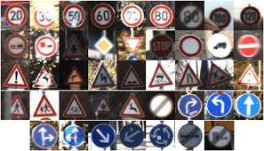

# **Traffic Sign Recognition**

## Overview

This is my second project in [Udacity Self-Driving Car NanoDegree Program](http://www.udacity.com/drive).

In this project, you will use what you've learned about deep neural networks and convolutional neural networks to classify traffic signs. You will train and validate a model so it can classify traffic sign images using the [German Traffic Sign Dataset](http://benchmark.ini.rub.de/?section=gtsrb&subsection=dataset). After the model is trained, you will then try out your model on images of German traffic signs that you find on the web.

## Contents

* `Traffic_Sign_Classifier.ipynb`: jupyter notebook used throughout this project
* `writeup.md`: reflection report that describes the pipeline
* `images`: images used in writeup

## Instructions

Get started [here](https://github.com/udacity/CarND-Term1-Starter-Kit/blob/master/README.md). You can install some softwares needed in this project along the way.
