# **Traffic Sign Recognition**

---

The goals / steps of this project are the following:
* Load the data set
* Explore, summarize and visualize the data set
* Design, train and test a model architecture
* Use the model to make predictions on new images
* Analyze the softmax probabilities of the new images
* Summarize the results with a written report

---

### Reflection

#### Data Set Summary & Exploration

##### 1. Provide a basic summary of the data set. In the code, the analysis should be done using python, numpy and/or pandas methods rather than hardcoding results manually.

* Number of training examples = 34799
* Number of testing examples = 12630
* Image data shape = (32, 32, 3)
* Number of classes = 43

##### 2. Include an exploratory visualization of the dataset.

Here is an exploratory visualization of the data set.

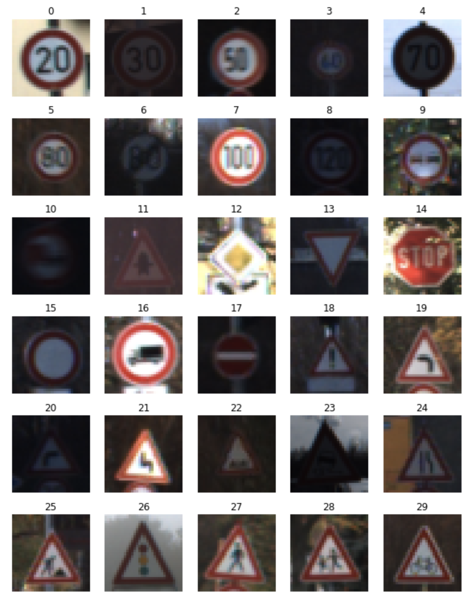

The bar chart below shows how the data is distributed over each class.

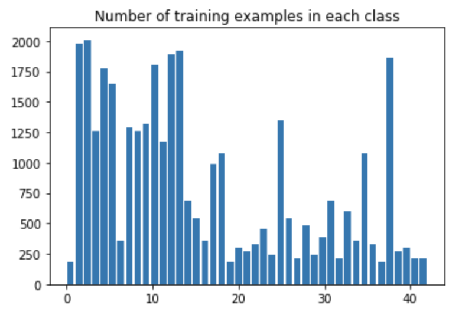

 

#### Design and Test a Model Architecture

##### 1. Describe how you preprocessed the image data. What techniques were chosen and why did you choose these techniques? Consider including images showing the output of each preprocessing technique. Pre-processing refers to techniques such as converting to grayscale, normalization, etc. (OPTIONAL: As described in the "Stand Out Suggestions" part of the rubric, if you generated additional data for training, describe why you decided to generate additional data, how you generated the data, and provide example images of the additional data. Then describe the characteristics of the augmented training set like number of images in the set, number of images for each class, etc.)

###### Preprocessing
* Converting RGB to grayscale

I converted RGB image to grayscale because RGB image didn't give the model any improvement (even though RGB image contains more information than grayscale one).

* Normalization (mean zero)

This slightly improved my model.

* Histogram equalization

Some images are darker than others so even I can barely see what their images' signs are. Histogram equalization made them look clearer so it can be more easily recognized.

The image below shows some preprocessed images.

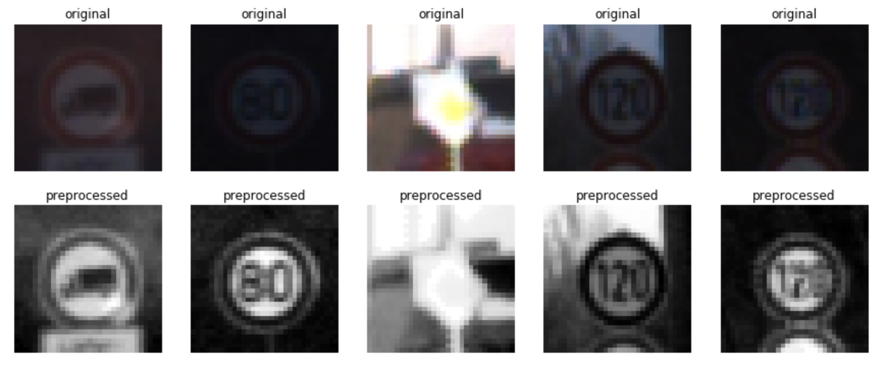

###### Data Augmentation
* Flipping (horizontally, vertically, or both)
* Scaling (×1.2)
* Rotation (-35~35 degree)

The original data is unbalanced (some classes have more than 1000 images but some don't). To mitigate this issue, I augmented data by those techniques above. This data augmentation increased training data size from 34799 to 172000.

The bar chart below shows how the data is distributed over each class after data augmentation.

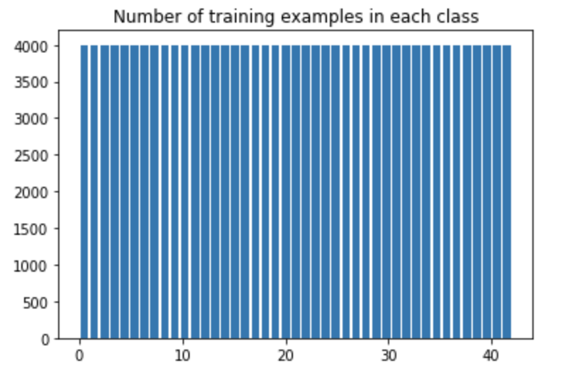

The image below shows some augmented images.

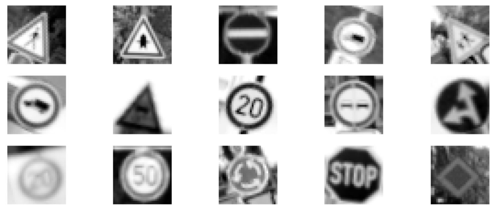

##### 2. Describe what your final model architecture looks like including model type, layers, layer sizes, connectivity, etc.) Consider including a diagram and/or table describing the final model.

My final model consisted of the following layers:

| Layer             |     Description	        					          |
|:-----------------:|:-------------------------------------------:|
| Input         		| 32x32x1 RGB image   							          |
| Convolution 5x5   | 1x1 stride, same padding, outputs 32x32x32 	|
| RELU					    |												                      |
| Max pooling	      | 2x2 stride,  outputs 16x16x32 				      |
| Convolution 5x5  	| 1x1 stride, same padding, outputs 16x16x64 	|
| RELU					    |												                      |
| Max pooling	      | 2x2 stride,  outputs 8x8x64 				        |
| Fully connected		| outputs 1024        									      |
| RELU					    |												                      |
| Dropout					  |	keep_prob 0.5 (only for training)		   			|
| Fully connected		| outputs 256       									        |
| RELU					    |												                      |
| Dropout					  |	keep_prob 0.5 (only for training)		   			|
| Fully connected		| outputs 43        									        |
| Softmax				    |             									              |

##### 3. Describe how you trained your model. The discussion can include the type of optimizer, the batch size, number of epochs and any hyperparameters such as learning rate.

* Optimizer: Adam
* Learning rate: 0.001
* Epochs: 15
* Batch size: 128

##### 4. Describe the approach taken for finding a solution and getting the validation set accuracy to be at least 0.93. Include in the discussion the results on the training, validation and test sets and where in the code these were calculated. Your approach may have been an iterative process, in which case, outline the steps you took to get to the final solution and why you chose those steps. Perhaps your solution involved an already well known implementation or architecture. In this case, discuss why you think the architecture is suitable for the current problem.

My final model results were:
* Validation set accuracy: 0.969
* Test set accuracy: 0.955

I first stated experimenting with LeNet. LeNet is very simple, but it actually worked well. Next I tried increasing the number of feature maps in the convolutional layers and units in the fully connected layers  and it gave the model additional improvement. Since training data was not that big, I thought the model might be overfitting, so I added dropout and it improved the model slightly. I also tried other architectures (more complicated one, like [this one](http://yann.lecun.com/exdb/publis/pdf/sermanet-ijcnn-11.pdf)), but I could't see any improvement so I stick to the simple one (modified LeNet).

 

#### Test a Model on New Images

##### 1. Choose five German traffic signs found on the web and provide them in the report. For each image, discuss what quality or qualities might be difficult to classify.

Here are five German traffic signs that I found on the web:

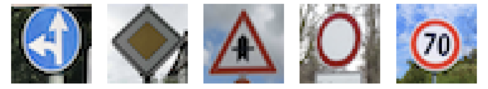

##### 2. Discuss the model's predictions on these new traffic signs and compare the results to predicting on the test set. At a minimum, discuss what the predictions were, the accuracy on these new predictions, and compare the accuracy to the accuracy on the test set (OPTIONAL: Discuss the results in more detail as described in the "Stand Out Suggestions" part of the rubric).

Here are the results of the prediction:

| Image			                              |     Prediction	              					|
|:---------------------------------------:|:---------------------------------------:|
| Go straight or right      		          | Go straight or right   									|
| Priority road   			                  | Priority road								          	|
| Right-of-way at the next intersection		| Right-of-way at the next intersection		|
| No vehicles     		                    | No vehicles			                        |
| Speed limit (70km/h)			              | Speed limit (70km/h)  				    			|

The model was able to correctly predict 5 of the 5 traffic signs, which gave 100% accuracy.

##### 3. Describe how certain the model is when predicting on each of the five new images by looking at the softmax probabilities for each prediction. Provide the top 5 softmax probabilities for each image along with the sign type of each probability. (OPTIONAL: as described in the "Stand Out Suggestions" part of the rubric, visualizations can also be provided such as bar charts)

Here are the results that shows softmax probabilities for each image.

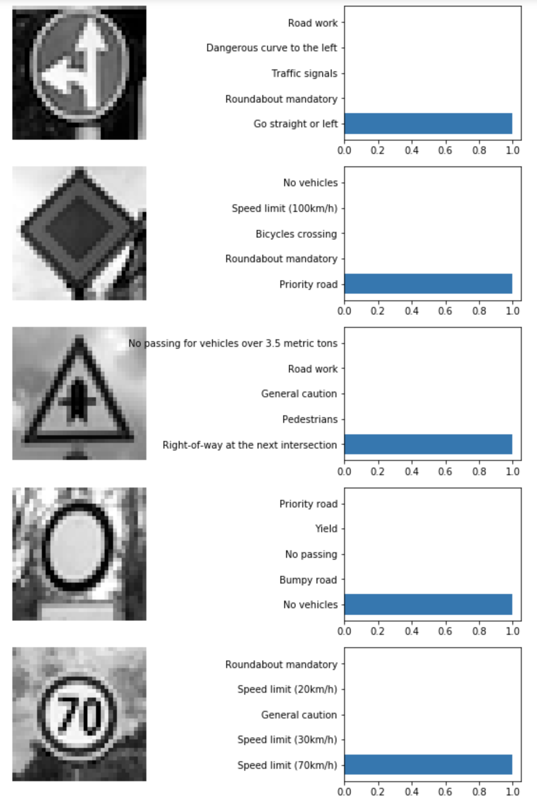

It shows that the model is pretty confident of its predictions.

 

#### (Optional) Visualizing the Neural Network (See Step 4 of the Ipython notebook for more details)

##### 1. Discuss the visual output of your trained network's feature maps. What characteristics did the neural network use to make classifications?

Here are the visualization of activations of each layer for some images.

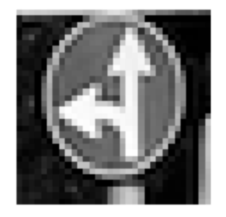

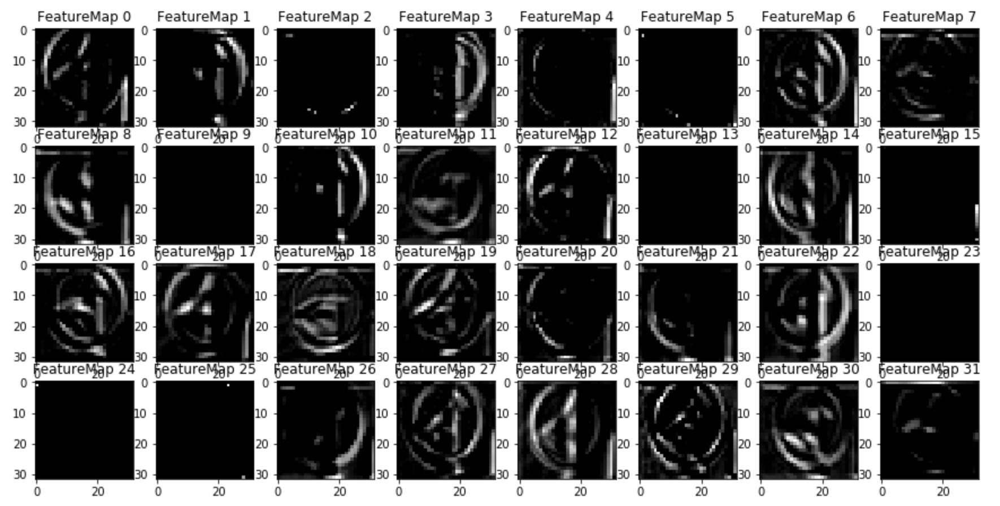

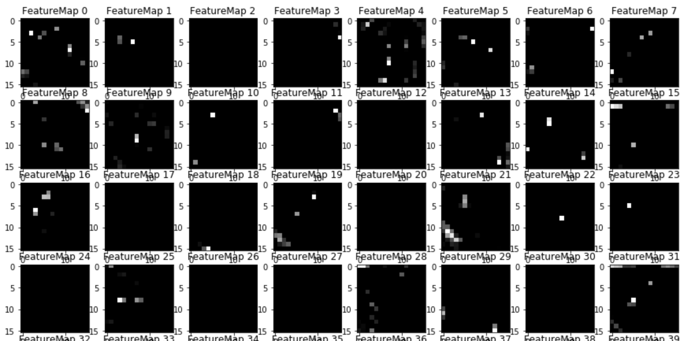

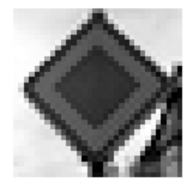

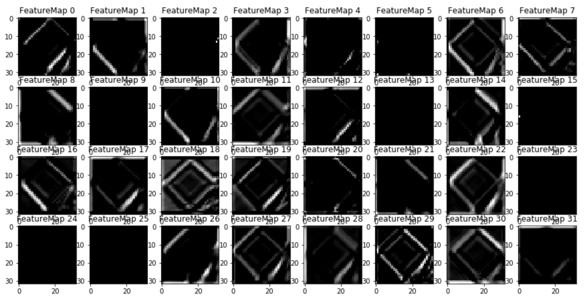

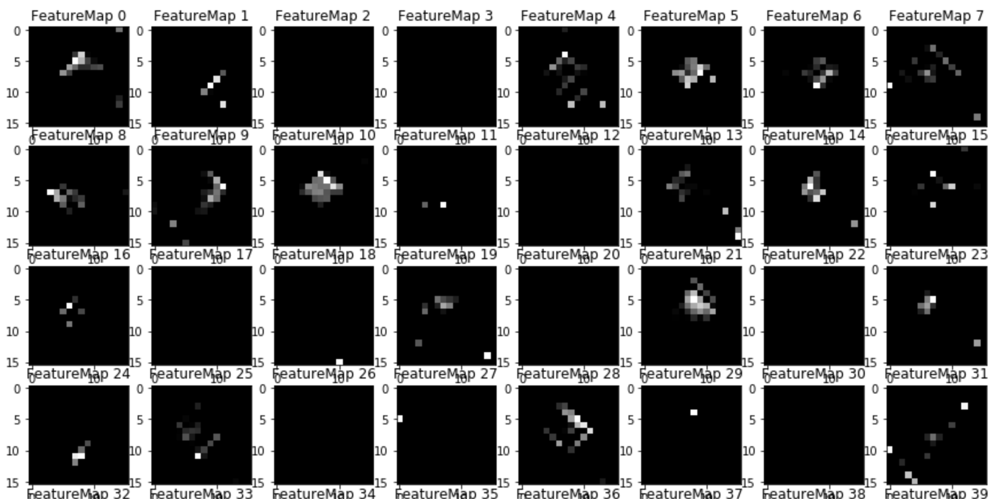

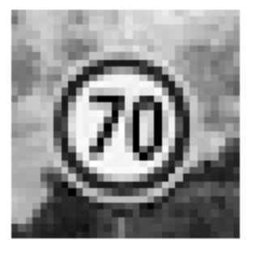

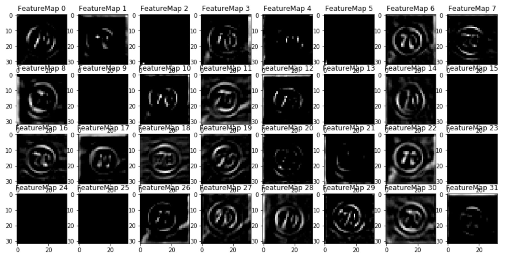

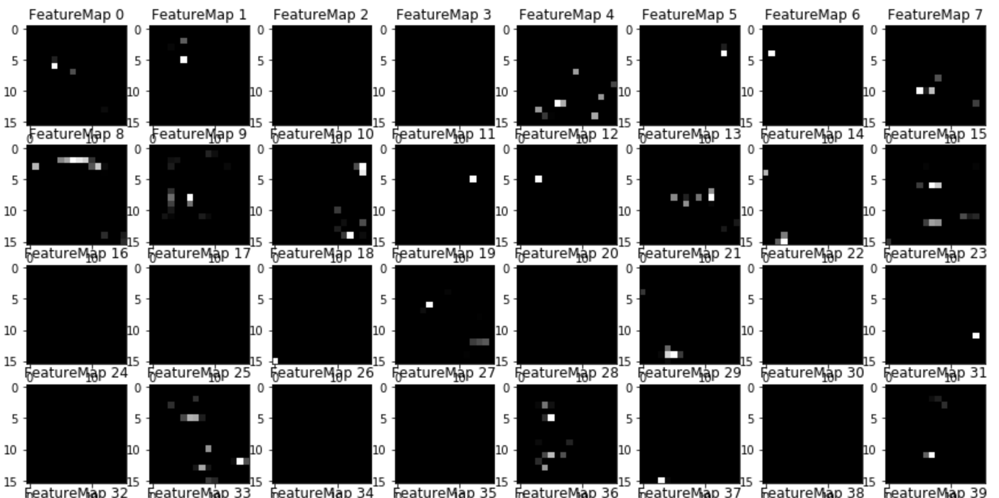

For each image, the upper image are the activations of first convolutional layer and the bottom one are of second convolutional layer.

The activations of first convolutional layer shows it had high activations to edges (it detected circles or diamonds) and signs (it detected arrows or numbers) itself.
